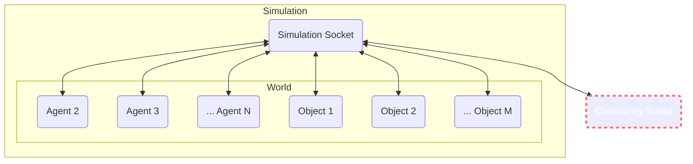
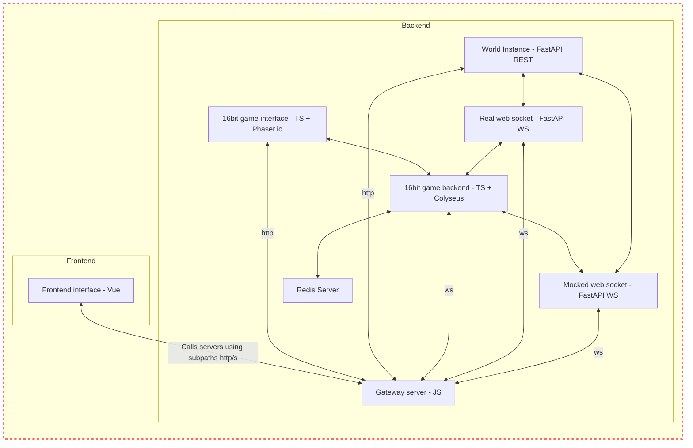

# Introduction

[The Roundtable](https://github.com/yeagerai/genworlds-community/tree/main/use_cases/roundtable) world enable you to create a podcast with anyone, on any topic. The agents can even be pre-loaded with custom memories that have been generated from public content, so that they can remember the past views and actions of the characters they're emulating.

## How it's built

It works by having a Microphone that each agent can have in their inventory. Only the holder of the microphone can speak, and they need to pass it on to the next speaker. The microphone solves the coordination problem of multiple agents speaking over each other.

It showcases how multiple agents can coordinate and work together using objects and their inventory.
