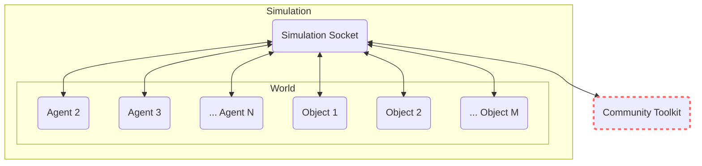
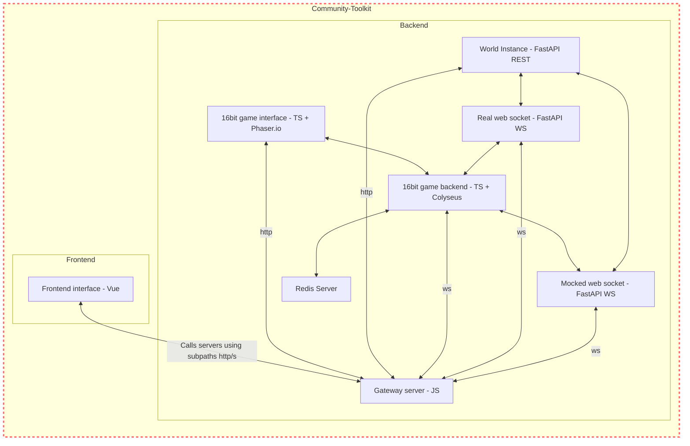

# Introduction

Welcome to GenWorlds Community Edition, a comprehensive toolkit that empowers you to construct and fine-tune unique AI worlds. Comprising an array of both backend and frontend services, GenWorlds Community Edition harnesses the power of Vue, JavaScript, Redis, WebSockets, and more, providing a well-rounded and potent suite for AI world development.

Whether you prefer using Replit or Docker, GenWorlds Community Edition is readily launchable, ensuring you can operate from your environment of choice.

## Key Features

### Backend and Frontend Services

Empower your AI world with an array of cutting-edge technologies, including Vue for frontend development, JavaScript for a dynamic user experience, Redis for cache management and data storage, and WebSockets for real-time communication. You can find more about the architecture in this document.

### Run Anywhere

With GenWorlds Community Edition, you can launch your AI world seamlessly on Replit or Docker, offering you the flexibility to operate in the environment you are most comfortable with.

### Fine-tune Your World

GenWorlds Community Edition also provides an array of tools allowing you to tailor your AI world according to your unique requirements.

## Architecture Overview

To help you understand the system better, here's an overview of the Simulation and Community Toolkit architectures.

### Simulation

The Simulation comprises a Simulation Socket connected to various Agents and Objects in the World, and it interfaces with the Community Toolkit.

### Community Toolkit

The Community Toolkit is an integral part of the GenWorlds Community Edition. It consists of a frontend and a backend. The frontend uses Vue, while the backend uses FastAPI, TypeScript, Redis, and more. Here's how they all interconnect:

