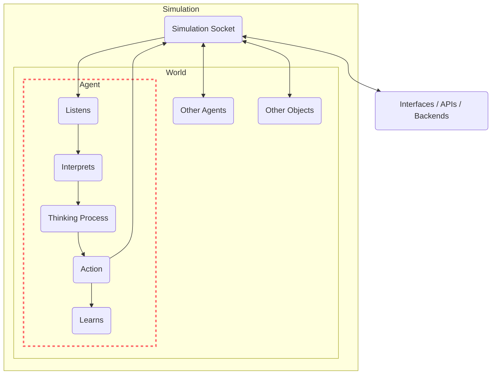

# Agents

Agents are the entities that interact with the world. They have a set of goals and try to accomplish them by planning a series of actions.

The agents interact with their environment by sending events through a WebSocket server initiated by the world. They dynamically learn about the world and the objects around them, figuring out how to utilize these objects to achieve their goals.

There can be many different types of agents, as long as each one of them understands the event protocol used to communicate with the [World](/docs/genworlds-framework/world.md)

## Agent Mental Model

The Generative Agents within GenWorlds follow a specific mental model at each step of their interaction with the world:

1. **Reviewing the world state and surrounding entities:** The agent assesses the environment it's in and the entities present around it to understand the context before planning any actions.

2. **Reviewing new events:** The agent evaluates any new occurrences. These could be actions taken by other agents or changes in the world state due to object interactions.

3. **Remembering past events and relevant information:** Using its stored memories, the agent recalls past experiences and data that might affect its current decision-making process.

4. **Updating the plan and deciding actions:** Based on the world state, new events, and past memories, the agent updates its action plan and decides on the next actions. These could involve interacting with the world, other agents, or objects. Importantly, an agent can execute multiple actions in one step, improving overall efficiency.

5. **Executing the actions:** Finally, the agent implements its plan, influencing the world state and potentially triggering responses from other agents.

This interactive process fosters the emergence of complex, autonomous behavior, making each agent an active participant in the GenWorld.

While we are currently focused on enhancing each of these steps, we foresee potential developments in the short-medium term. For instance, we're exploring the value and nature of "reflection" as an aspect of an agent's mental model. This would enable the agent to draw new conclusions from a set of recent memories and maintain high-level goals. We're also considering improvements to the communication systems between agents to facilitate more effective collaboration.

## BaseAgent

The BaseAgent is the most powerful and reliable type of agent available in the Genworlds framework.

It consists of a branching pipeline of multiple [Brains](/docs/genworlds-framework/agents/brains.md), that enable breaking down the task into smaller, more specific steps to improve the performance.

The first brain is always a navigation brain - it needs to select the next action for the agent.

Based on the selected action type, a pipeline of brains is chosen. There can be any number of various brains in the pipeline.

The output of each brain is passed to the next one, and the final brain needs to produce a complete set of parameters selected next action.



### Custom memories

Each agent can be pre-loaded with unique memories, enhancing its unique personality traits and subject matter expertise. These memories are injected on their prompts based on their relevance to the agent's current goals, allowing for more focused and reliable interactions.

Setting up these custom memories is straightforward with the [Qdrant](https://qdrant.tech/) vector database.

To use the memories, you need to set the following values in the world_definition.yaml file

```yaml
world_definition:
  world:
    ato_to_external_memory: ./databases/summaries_qdrant
```

And for each agent you need to specify the collection name

```yaml
agents:
    - id: maria
    personality_db_collection_name: maria
```
