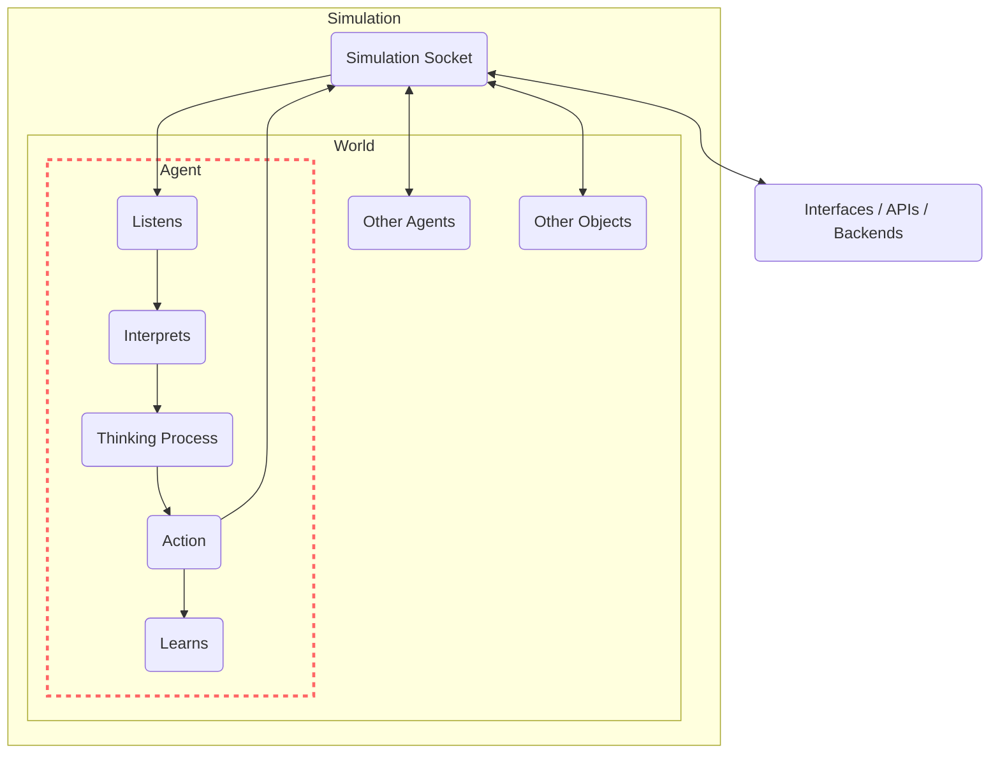

# Agents

Agents are the entities that interact with the world. They have a set of goals and try to accomplish them by planning a series of actions.

The agents interact with their environment by sending events through a WebSocket server initiated by the world. They dynamically learn about the world and the objects around them, figuring out how to utilize these objects to achieve their goals.

There can be many different types of agents, as long as each one of them understands the event protocol used to communicate with the [World](/docs/genworlds-framework/world.md)

## Agent Mental Model

The Generative Agents within GenWorlds follow a specific mental model at each step of their interaction with the world:

1. **Reviewing the world state and surrounding entities:** The agent assesses the environment it's in and the entities present around it to understand the context before planning any actions.

2. **Reviewing new events:** The agent evaluates any new occurrences. These could be actions taken by other agents or changes in the world state due to object interactions.

3. **Remembering past events and relevant information:** Using its stored memories, the agent recalls past experiences and data that might affect its current decision-making process.

4. **Updating the plan and deciding actions:** Based on the world state, new events, and past memories, the agent updates its action plan and decides on the next actions. These could involve interacting with the world, other agents, or objects. Importantly, an agent can execute multiple actions in one step, improving overall efficiency.

5. **Executing the actions:** Finally, the agent implements its plan, influencing the world state and potentially triggering responses from other agents.

This interactive process fosters the emergence of complex, autonomous behavior, making each agent an active participant in the GenWorld.


## BaseAgent

The `BaseAgent` serves as a foundational entity, providing the core functionalities and characteristics that all other specialized agents inherit. It encapsulates key properties such as the agent's identification, name, description, goals, interesting events, and memory capabilities, forming the backbone of every interactive entity within the simulation. The `BaseAgent` is also equipped with a brain — a complex assembly of systems enabling navigation and execution of various tasks — which sets the groundwork for the diverse behaviors exhibited by the agents.

One of the vital functionalities of the `BaseAgent` is communication. It integrates a `WorldSocketClient`, an interface that connects the agent to the world, allowing it to send messages and interact with the environment. Moreover, it employs a `ListeningAntenna`, keeping the agent informed about the world state, nearby entities, and available events in real-time. This communication infrastructure is pivotal in enabling complex, dynamic, and interactive simulations.

However, the heart of the `BaseAgent` lies in its ability to 'think,' enabling autonomous interactions within the GenWorlds environment. The 'think' function is where the agent perceives the world, processes the information, devises a plan, and takes actions to achieve its goals. This function, which is typically run on a separate thread, continuously operates throughout the agent's lifecycle, endowing it with the intelligence to navigate the world, respond to events, and adapt its behavior.

In terms of decision-making, the BaseAgent uses various 'Brain' classes such as navigation brain and execution brains to strategize its actions. It's also equipped with a memory system, which maintains a summary of past events and uses it to inform future actions. It's important to note that agents can 'sleep', during which they cease to perceive and act in the world, but they can be awakened by specific events. All these functionalities together give the BaseAgent the ability to perceive, process, plan and perform actions in the simulated world.



### Custom memories

Each agent can be pre-loaded with additional memories, enhancing its unique personality traits and subject matter expertise. These memories are injected on their prompts based on their relevance to the agent's current goals, allowing for more focused and reliable interactions.

Setting up these custom memories is straightforward with the [Qdrant](https://qdrant.tech/) vector database.

To use the memories, you need to set the following values in the world_definition.yaml file

```yaml
world_definition:
  world:
    ato_to_external_memory: ./databases/summaries_qdrant
```

And for each agent you need to specify the collection name

```yaml
agents:
    - id: maria
    personality_db_collection_name: maria
```
