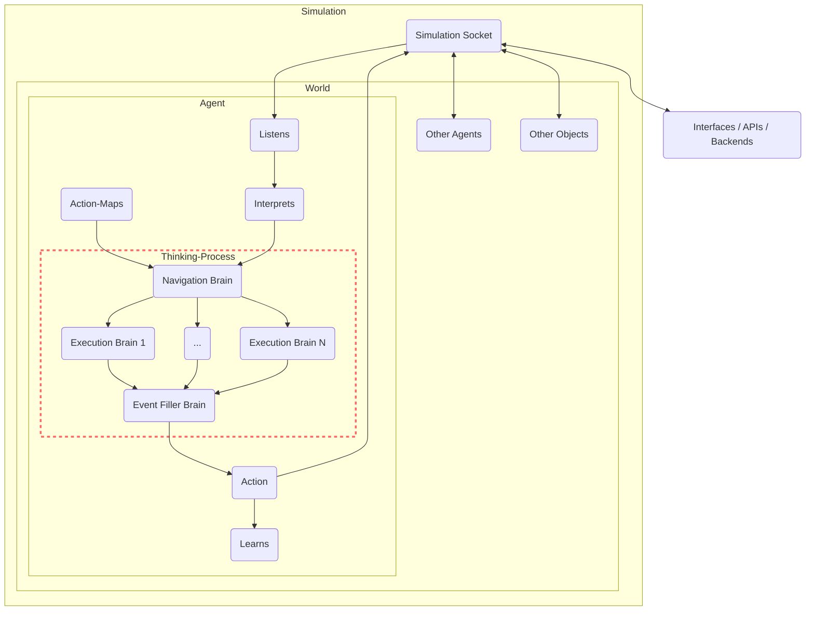

# Thinking Process

Brains are the principal components of the thinking process of the [BaseAgent](/docs/genworlds-framework/agents/agents.md). The `think()` method in the code is the central function where the thinking process is carried out. The function first acquires the initial state of the world and potential actions to be performed. It then enters a loop, where it processes events and evaluates entities in the agent's proximity to inform its decision-making. Depending on the current state and goals of the agent, the `think()` function may choose to wait, respond to user input, or interact with entities. If the agent selects an action, it executes it and updates its memory accordingly. The `think()` function continually updates the agent's state in the world and repeats the process until it decides to exit.

A brain takes as input all the variables of the agent - its name and background, personality, goals, memories and nearby agents and objects - and produces a desired output, through one or more steps.

The GenWorlds Framework, with its modular design, supports the development of Brains from the simple to the complex, and the implementation of diverse cognitive techniques. It achieves this through a separation of concerns, focusing on the "thinking" component, leaving perception and action to the framework. Scalability is inherent to its design, accommodating Brains from the elementary to those leveraging advanced models like Tree-of-Thought. The interchangeability feature enables comparison of different techniques within the same problem set, fostering continuous learning and improvement. This blend of modularity, separation of concerns, scalability, and interchangeability makes the GenWorlds Framework a versatile tool in the evolution and application of AI techniques.

Brains take full advantage of [OpenAI Functions](https://openai.com/blog/function-calling-and-other-api-updates) to allow easy specification of the desired output json format.

Following is a flow chart diagram of an agent's thought process:



## Understanding Brains

A Brain in GenWorlds is a system that controls one step of an Agent's thinking process. It manages the process of thought generation, evaluation, and selection. The Brain class defines the functions necessary for these processes and uses a Large Language Model to generate and evaluate thoughts.

Different types of brains can be created to handle different tasks, scenarios, or problems. Each brain type is a subclass of the base `Brain` class and modifies the configuration parameters to suit the specific task.

### Important Brains

#### NavigationBrain

The `NavigationBrain` class is designed for selecting the next action which helps the agent achieve its goals. It generates a plan for the Agent's next steps in the World. The inputs to this class include the Agent's information (name, role, background, personality), goals, constraints, evaluation principles, and the number of thoughts to generate.  It generates a set of possible plans, each consisting of an action to take, whether the action is valid, any violated constraints, and an updated plan. The NavigationBrain then evaluates these plans and selects the one that best meets the evaluation principles and constraints.

Sometimes you want to constrain the sequence of actions and force the Agent to follow a certain action with another one - this can be done using the Action-Brain map. 
#### Execution Brains

Execution Brains enable the execution of diverse tasks by Agents. These Brains accept Agent details, task attributes, constraints, and evaluation parameters. These brains can be configured to generate their output in a single call, or generate multiple potential outputs and select the best one using self-evaluation techniques. 

The power of Execution Brains lies in their customizability. Developers can create Brains adapted for various tasks such as participating in a podcast, writing an essay, analyzing data, or scraping social media feeds. This flexibility allows the creation of uniquely skilled Agents capable of performing a wide array of tasks in their simulated environments. 


#### EventFillerBrain

The `EventFillerBrain` class is used for generating the JSON parameters required for an action the agent is about to execute in a world simulation. The inputs to this class are similar to the `NavigationBrain` class but also include the command the agent is has decided to execute.

### Brain Types

All of the above brains subclass one of the basic Brain type base classes. Each brain class provides different capabilities, and the choice of brain class should align with the complexity and nature of the tasks the agent will perform. This decision has direct implications on the efficiency and success of your simulation.

For simpler tasks, a basic brain class would suffice, offering straightforward task execution and ensuring resource optimization. However, for complex tasks, advanced brains are more suitable. They utilize sophisticated techniques and provide a comprehensive set of functionalities to handle complex interactions and decision-making processes. Choosing the right brain type is essential to create effective simulations and leverage the full potential of the GenWorlds Framework.

#### Zero-Shot brain

This is the simplest type of brain - it produces an output in a single LLM call.

#### Single-Eval Brain

This brain uses two LLM calls - the first one to produce multiple possible versions of the desired output, and the second one to pick the best one.

#### Multi-Eval Brain

Similar to Single-Eval Brains, a Multi-Eval brain produces a number of possible output options, however instead of a single evaluation call to pick the best output, it calls the evaluation LLM once for each output and asks it to rate it from 1 to 10.

It then sorts then by the rating and picks the best one. It also allows setting a threshold rating - if the best options is below that, the brain instead returns `None`.

### The Action-Brain Map

The Action-Brain Map of an Agent defines a deterministic path through the various Brains. It's the system that decides which Brain to use based on the Agent's next action. The output of each brain is passed on to the consecutive brain in the execution brain path of that action. In the [Roundtable example](/docs/example-usecases/roundtable.md) it will engage the Podcast Brain when the Agent is about to speak, and pass the output to the Event Filler Brain to generate a valid World event with the generated response. 

You can furthermore specify a deterministic follow-up for each action if you don't want the agent to choose freely - for example, after speaking into the microphone, the Agent must pass it to someone else. This allows you to constrain the Agent to create more predictable execution paths and increase reliability.

Here's what that looks like in code:

```python
action_brain_map = {
    "Microphone:agent_speaks_into_microphone": {"brains":[
        "podcast_brain",
        "event_filler_brain",
    ], "next_actions": ["World:agent_gives_object_to_agent_event"]},
    "World:agent_gives_object_to_agent_event": {"brains":["event_filler_brain"], "next_actions": []},
    "default": {"brains":["event_filler_brain"], "next_actions": []},
}
```

