# Thinking Process

Brains are the principal components of the thinking process of the [BaseAgent](/docs/genworlds-framework/agents/agents.md).

A brain takes as input all the variables of the agent - its name and background, personality, goals, memories and nearby agents and objects - and produces a desired output, through one or more steps.

Brains can be as simple or complex as needed, and allow taking advantage of the latest techniques such as Self-evaluation, Chain-of-Thought, Tree-of-Thought, Committee-of-Experts and any other ones that will be discovered.

Brains take full advantage of [OpenAI Functions](https://openai.com/blog/function-calling-and-other-api-updates) to allow easy specification of the desired output json format.

```mermaid
graph TD
    subgraph Simulation
        W1(Simulation Socket)
        subgraph World
          subgraph Agent
              P1(Listens)
              P2(Interprets)
              AM(Action-Maps)
              AM-->B1
              subgraph Thinking-Process
                  B1(Navigation Brain)
                  B2(Execution Brain 1)
                  B3(...)
                  B4(Execution Brain N)
                  B5(Event Filler Brain)
                  B1-->B2
                  B1-->B3
                  B1-->B4
                  B2-->B5
                  B3-->B5
                  B4-->B5
              end
              P4(Action)
              P5(Learns)
              P1-->P2
              P2-->B1
              B5-->P4
              P4-->P5
          end
            A1(Other Agents)
            O1(Other Objects)
        end
    end
  I1(Interfaces / APIs / Backends)
  W1-->P1
  P4-->W1
  W1<-->A1
  W1<-->O1
  W1<-->I1
  style Thinking-Process stroke:#f66,stroke-dasharray: 5 5, stroke-width:3px
```

## Types of Brains

### Zero-Shot brain

This is the simplest type of brain - it produces an output in a single LLM call.

### Single-Eval Brain

This brain uses two LLM calls - the first one to produce multiple possible versions of the desired output, and the second one to pick the best one.

### Multi-Eval Brain

Similar to Single-Eval Brains, a Multi-Eval brain produces a number of possible output options, however instead of a single evaluation call to pick the best output, it calls the evaluation LLM once for each output and asks it to rate it from 1 to 10.

It then sorts then by the rating and picks the best one. It also allows setting a threshold rating - if the best options is below that, the brain instead returns `None`.
