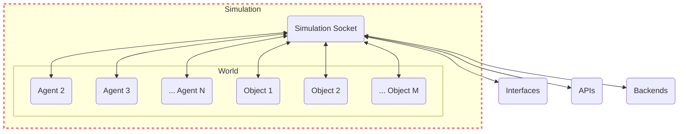

# Simulation

## Overview

A Simulation serves as the top-tier concept within the GenWorlds framework. It is the binding layer that weaves together a [World](/docs/genworlds-framework/world.md), [Agents](/docs/genworlds-framework/agents/agents.md) and [Objects](/docs/genworlds-framework/objects.md) into a cohesive simulation environment. The Simulation class instantiates these components, manages their life cycles, and synchronizes their interactions via threads.

At the core of the simulation lies a websocket server, termed as the 'Simulation Socket' in the diagram below. This server serves as the communication hub, facilitating data exchange between the world, agents, objects, as well as interfaces, APIs, and backends.

The diagram below visually represents the structure of a simulation:



## Simulation Socket

The Simulation Socket is essentially a websocket server which serves as the communication backbone of the Simulation. It enables parallel operation of the World, Agents, and Objects, and allows them to communicate by sending events. This architecture supports connecting frontends or other services to the world, running agents on external servers, and much more.

## World Versus Simulation

In the GenWorlds framework, the distinction between a World and a Simulation is crucial for understanding the system's operation.

A World serves as a template or a blueprint, defining the common properties, rules, and behaviors that its constituent entities—Agents and Objects—would follow. It provides the environment and sets the stage for the interaction of the agents and objects.

However, a World in itself does not entail any activity or interaction; it merely provides the potential for such interactions to take place. To bring a world to life, to initialize its properties, and to instigate the interaction among its components, we need to instantiate a Simulation.

A Simulation can be seen as the dynamic realization of a World. It is an active instance of a world, complete with its agents and objects, and their respective behaviors. When a Simulation is launched, it brings the static World into motion. It starts and manages the life cycles of the World, Agents, and Objects. It launches the websocket server which forms the communication hub for the agents and objects and the outside interfaces and backends.

In essence, while a World is the structural framework, a Simulation is the operational realization of that framework. The World sets the stage, and the Simulation performs the play.

## Creating a Simulation

Creating a Simulation in GenWorlds is a straightforward process. You provide the necessary components — World, Agents, and Objects — and pass them as arguments while creating an instance of the Simulation class.

```python
simulation = Simulation(
    name="Example Simulation",
    description="This is an example simulation",
    world=world,
    objects=objects,
    agents=agents,
)

# this attaches to the websocket all the objects and agents in the world
simulation.launch()
```

The `simulation.launch()` method kickstarts the simulation by registering the agents and objects to the world, starting the websocket server, and then launching the threads for the agents and objects. This websocket server is essential for facilitating communication between the world, agents, and objects, and for allowing external interfaces, APIs, or backends to interact with the world.

Thus, the Simulation in GenWorlds is a highly interconnected system, built to handle complex interactions and enable scalable, parallel operations across multiple components.
