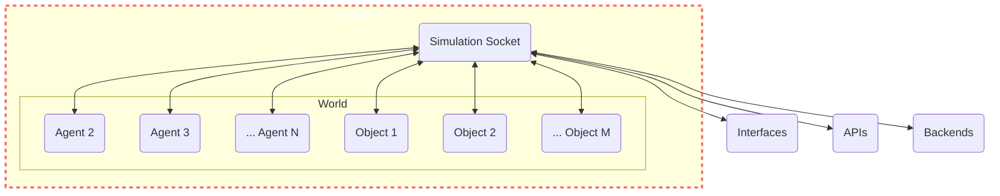

# Simulation

A Simulation is the highest level abstraction in the Genworlds framework. It ties together a [World](/docs/genworlds-framework/world.md), [Agents](/docs/genworlds-framework/agents/agents.md) and [Objects](/docs/genworlds-framework/objects.md), starts and manages their threads.



## Creating a Simulation

```python
simulation = Simulation(
    name="Example Simulation",
    description="This is an example simulation",
    world=world,
    objects=objects,
    agents=agents,
)

# this attaches to the websocket all the objects and agents in the world
simulation.launch()
```

## Websocket Server

The [World](/docs/genworlds-framework/world.md), [Agents](/docs/genworlds-framework/agents/agents.md) and [Objects](/docs/genworlds-framework/objects.md) all interact through a websocket server and communicate by sending events. This allows for parallel operation, easily connecting a frontend or some other service to the world, as well as running agents on external servers, such as the Genworlds Marketplace.
