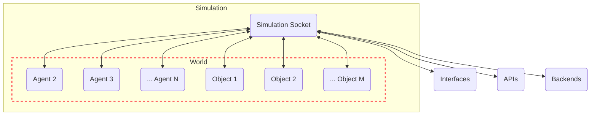

# World

The 'World' in GenWorlds serves as the setting for all the action. It keeps track of all the agents, objects, and world properties such as agent inventories.

The World ensures every agent is informed about the world state, entities nearby, and the events that are available to them to interact with the world.

Here's a graphical representation of how the World interacts with other components in the system:



The World is designed with flexibility in mind, thanks to the `BaseWorld` class. This enables the easy addition of new world properties. For instance, the `World2D` class, which is an extension of `BaseWorld`, adds a spatial dimension to the world by introducing a `location` property for agents and objects.

Here's an example of how you might instantiate a `World2D` object:

```python
world = World2D(
    id="world",
    name="roundtable",
    description="This is a podcast studio, where you record the Roundtable podcast.,
    locations=["roundtable"],
)
```

## World2D

`World2D` extends `BaseWorld` by adding spatial attributes to the world environment. Here, each agent and object possesses a location property selected from a list of pre-specified locations. The `World2D` setup restricts an agent's perceptual field to other agents and objects that share the same location. The `get_nearby_entities` method handles this by returning a list of entities that are either in the same location or are directly associated with the querying agent (for example, objects held by the agent).

An event listener method, `agent_moves_to_new_location_listener`, is defined to handle the situation where an agent moves to a new location. This method updates the agent's location and then sends an update of the world state to the agent.

In terms of real-world parallels, `World2D` functionality could be likened to a Discord server. Here, an agent acts as a user and can be present in one of the available channels at any given time. The agent is aware only of the activities and users in the same channel, mirroring the agent-object location-based interaction in `World2D`.

The practical value of having a spatial world, such as `World2D`, is to create an organized environment with distinct sections, each designated for specific activities and interactions, similar to an airport or a football field in the physical world.

- Structure and Context: In a spatially organized environment like an airport, different areas are designated for specific purposes, like check-ins, security, boarding, dining, etc. Similarly, World2D creates structured environments where specific interactions can occur, offering context to the interactions between agents and objects.

- Scope Limitation: Just as football players focus on their immediate surroundings and the ball rather than the entire field or stadium, World2D restricts an agent's perceptual field. This allows for more concentrated and relevant interactions between agents and objects in the same location.

- Dynamic Interactions: In spatially organized environments, the transition from one place to another triggers different sets of interactions and events. For example, moving from the boarding gate to the airplane in an airport or a player moving with the ball across the football field. This mirrors the agent_moves_to_new_location_listener function in World2D, which adjusts the agent's surroundings and interactions as they move to a new location.

- Modeling Real-world Scenarios: Spatial worlds allow for the modeling of more realistic and complex scenarios. From simulating a bustling airport terminal to recreating a competitive football match, World2D can encapsulate a diverse range of real-world systems and environments.

In essence, the ability to create spatial worlds in AI, like World2D, can make agent interactions more dynamic, contextual, and reflective of real-world situations.
