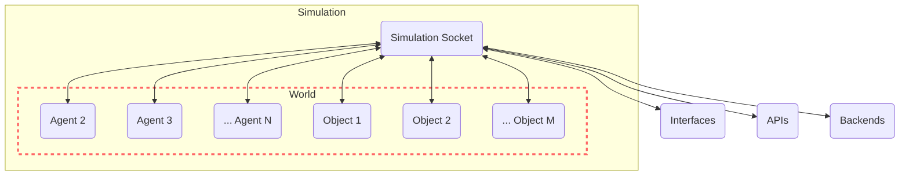

# World

The 'World' in GenWorlds serves as the setting for all the action. It keeps track of all the agents, objects, and world properties such as agent inventories.

The World ensures every agent is informed about the world state, entities nearby, and the events that are available to them to interact with the world.



The BaseWorld class has been designed with extensibility in mind, enabling the introduction of new world properties. An example of this is the World2D class in our examples, which introduces a location property, adding a spatial dimension to the world.

```python
world = World2D(
    id="world",
    name="roundtable",
    description="This is a podcast studio, where you record the Roundtable podcast.,
    locations=["roundtable"],
)
```

## World2D

World2D is an extension of the BaseWorld, where each agent and object has a location from a list of locations. Agents only see agents and objects in the same location.

This world also maps to something like a Discord server, where the agent would be in one of many channels at a time.
