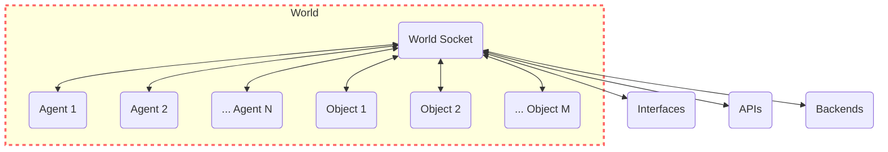

# World

The 'World' in GenWorlds serves as the setting for all the action. It keeps track of all the agents, objects, and world properties such as agent inventories.

The World ensures every entity (mainly objects and agents) is informed about the events that happen in the world, and the available actions and entities to interact.

Here's a graphical representation of how the World interacts with other components in the system:



## Properties

* **Basic Properties**: `name`, `id`, and `description` are the basic properties of the World. They are used to identify the World and to provide a description of the World mainly to agents.

* **World Socket Server**: The World Socket Server is the main communication channel where world entities (socket clients) send and receive events from.

* **Objects**: Objects are the main entities that populate the World. Used in general to perform deterministic actions. Are reactive to events that happen in the World.

* **Agents**: Agents are autonomous AI Agents that are active in the world in the sense that they can trigger events to activate other entities. Those are commonly used to perform non-deterministic actions and take non-deterministic desicions.

* **Actions**: World Actions are the actions that define the World. There are two specific actions that must be defined by the developer which are `get_available_entities`, and `get_available_action_schemas` which essentially helps you define the concept of availability. For example in our `BaseWorld` available entities are all entities, and available actions are all actions. But the developer can redefine this concept to define a more complex world with gated content depending on different variables.

    A part from those two actions, usually the rest of world actions are used to interact with the user interfaces or backends, to send specific details about the world so it can be rendered in a webapp for instance.

* **World Entity Type**: All world entities are defined by a type. This is used to identify the entity and to provide other characteristics that can be useful later on during the simulation.

## Usage Example

The easiest way to start using worlds, is to use the worlds defined in the GenWorlds utility layer. That is inside `genworlds/worlds/concrete` for example to use the `BaseWorld` you can do:

```python
from genworlds.worlds.concrete.base.world import BaseWorld

# Define the World
hello_world = BaseWorld(
    name="Test World",
    description="A basic world to test some experiments.",
)

# Launch the socket server
hello_world.launch()
```

## Custom World and Actions

To create a custom world, you can start looking for the different implementations in our basic utility layer at `genworlds/worlds/concrete`. For example let's take a look at the `ChatInterfaceWorld`:

```python
# Omitted imports for readibility

class ChatInterfaceWorld(AbstractWorld):
    def __init__(
        self,
        name: str,
        description: str,
        agents: List[AbstractAgent] = [],
        objects: List[AbstractObject] = [],
        actions: List[Type[AbstractAction]] = [],
        id: str = None,
        screens_config_path: str = "./screens_config.json",
    ):
        self.screens_config_path = screens_config_path

        # availability = all entities
        get_available_entities = WorldSendsAvailableEntities(host_object=self)
        get_available_action_schemas = WorldSendsAvailableActionSchemas(
            host_object=self
        )
        actions.append(get_available_entities)
        actions.append(get_available_action_schemas)

        actions.append(WorldSendsScreensToUser(host_object=self))

        super().__init__(
            name=name,
            description=description,
            agents=agents,
            objects=objects,
            actions=actions,
            get_available_entities=get_available_entities,
            get_available_action_schemas=get_available_action_schemas,
            id=id,
        )
```

As you can see, the `ChatInterfaceWorld` is a custom world that inherits from `AbstractWorld`. It defines a custom `__init__` method that defines the `get_available_entities` and `get_available_action_schemas` actions. It also defines a custom action `WorldSendsScreensToUser` that is used to send the screens configuration to the user interface.

So basically a world is defined by its actions. The same happen to objects and agents. Now let's take a closer look at the `WorldSendsAvailableEntities` action:

```python
class AgentWantsUpdatedStateEvent(AbstractEvent):
    event_type = "agent_wants_updated_state"
    description = "Agent wants to update its state."
    # that gives available_action_schemas, and available_entities


class WorldSendsAvailableEntitiesEvent(AbstractEvent):
    event_type = "world_sends_available_entities_event"
    description = "Send available entities."
    available_entities: dict


class WorldSendsAvailableEntities(AbstractAction):
    trigger_event_class = AgentWantsUpdatedStateEvent
    description = "Send available entities."

    def __init__(self, host_object: AbstractObject):
        super().__init__(host_object=host_object)

    def __call__(self, event: AgentWantsUpdatedStateEvent):
        self.host_object.update_entities()
        all_entities = self.host_object.entities
        event = WorldSendsAvailableEntitiesEvent(
            sender_id=self.host_object.id,
            available_entities=all_entities,
            target_id=event.sender_id,
        )
        self.host_object.send_event(event)
```

As you can see, the `WorldSendsAvailableEntities` action is defined by a `trigger_event_class` which is the event that triggers the action. In this case the `AgentWantsUpdatedStateEvent` is triggered by the agent when it wants to update its state. The action then calls the `update_entities` method of the host object which is the world. And then it sends the `WorldSendsAvailableEntitiesEvent` to the agent with the available entities. Remember that all this communication happens asynchronously through the socket server where every entity (world included) has its own event-listener.
