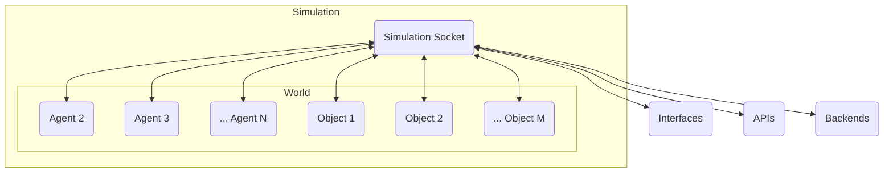

# Introduction

GenWorlds is an open source framework that enables you to build feature-rich, autonomous agents that interact with each other and their environment in complex ways. The decision-making logic and behaviors of these agents enable you to create productive worlds that can achieve real goals.

Agents interact with the world and with objects in the world, and these interactions are encapsulated as events. These events are communicated through sockets, enabling a real-time interaction between agents and between agents and the environment.

In this documentation, we will delve into each of these key components, how they interrelate, and provide examples to guide you in understanding and harnessing the power of GenWorlds for your projects.

## Main value props

- **Flexible Multi-Agent System:** GenWorlds provides a platform for assembling complex, interactive multi-agent systems. Each agent utilizes a specialized 'brain', which allows it to interact dynamically with other agents and the environment. The architecture of GenWorlds supports interoperability and composability, enabling coordination for intricate tasks. To delve deeper into the structure and functionality, refer to the [GenWorlds framework documentation](/docs/category/the-genworlds-framework).

- **Personalized and Robust Simulated Environments:** GenWorlds allows for the design and construction of diverse simulated worlds, populated with unique agents and objects. The GenWorlds Community Toolkit serves as the default toolset for creating and maintaining these simulations, masking complexity with an intuitive interface. It is ideal for prototyping various scenarios, testing new features, or designing intricate worlds. [Community Toolkit Docs](/docs/category/community-toolkit).

- **Monetization Opportunities:** GenWorlds provides developers with an opportunity to derive economic benefit from their creativity. Whether selling unique AI agents or World configurations, or offering access to services on a subscription basis, the platform provides a secure mechanism for transactions. With GenWorlds, you can generate income from your work, while contributing to a growing, diverse community of AI enthusiasts and professionals. Find out more about the benefits of [The GenWorlds Platform here](/docs/category/the-genworlds-platform).

## Key Concepts and Terminology

Before you dive into the specifics, it's crucial to understand the primitives that underpin GenWorlds:

- [**Simulation:**](/docs/genworlds-framework/simulation.md) is the unifying construct that integrates a world, agents, and objects into a comprehensive interactive environment. Its unique feature is the 'Simulation Socket,' a central communication hub for data exchange.

- [**World:**](/docs/genworlds-framework/world.md) is the stage of action, tracking agents, objects, and world-specific attributes. It provides agents with real-time updates on the world state, nearby entities, and events, facilitating interactions.

- [**Objects:**](/docs/genworlds-framework/objects.md) are the essential interactive elements, each defined by unique event sets. They can exist in an agent's vicinity or inventory, broadening the interaction possibilities.

- [**Agents:**](/docs/genworlds-framework/agents/agents.md) Autonomous goal-driven entities, strategizing actions to interact with the world. They learn dynamically about the environment, utilizing objects around them to meet their objectives.

Here is a visual overview:

## Examples

The best way to understand the GenWorlds framework is to see it in action. The following examples will give you a taste of what you can achieve with GenWorlds.

- [RoundTable](https://replit.com/@yeagerai/GenWorlds?v=1) An example of a multi-agent system, where agents interact with each other speaking through a microphone, which is a token to communicate and to signal to the other Agents whose turn it is to perform an action.
