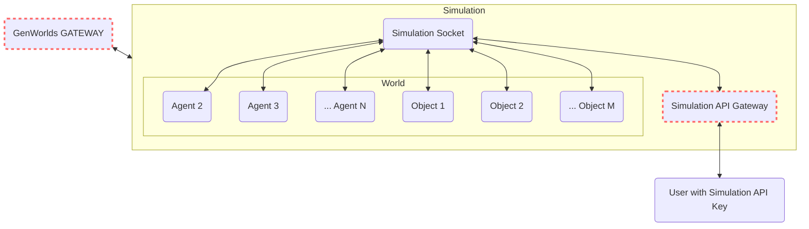

# A Hub for AI Innovation and Trade

Welcome to the GenWorlds Platform, an innovative ecosystem that is revolutionizing the field of artificial intelligence. With a focus on creating, sharing, and monetizing unique AI Worlds and Agents, GenWorlds provides the infrastructure necessary for both developers and users to navigate the AI landscape with ease and efficiency. The platform offers two key features: the GenWorlds Engine and the GenWorlds Marketplace.

## GenWorlds Engine

At the heart of the GenWorlds Platform lies the GenWorlds Engine. Built on a robust and scalable infrastructure, the GenWorlds Engine facilitates the creation of dynamic AI Worlds and Agents. It leverages the power of state-of-the-art AI models and allows the hosting of simulations, memories, caches, and more to ensure everything works smoothly for both developers and users.

With the GenWorlds Engine, you can:

- **Create and Manage AI Worlds:** With our user-friendly toolset, developers can construct their own AI Worlds, populate them with unique AI Agents, and manage them seamlessly.

- **Design and Implement AI Agents:** Craft intelligent Agents using our extensive resources and have them interact in dynamic AI Worlds.

- **Access and Manipulate Simulations:** As a user, you can interact with AI Worlds and Agents purchased or rented from the GenWorlds Marketplace using your unique API key, through the Simulation API Gateway.

## GenWorlds Marketplace

The GenWorlds Marketplace is a vibrant hub where developers and users meet to trade unique AI Worlds and Agents. It extends beyond a mere marketplace and transforms into a community where ideas and value exchange hands.

As a developer, the Marketplace allows you to:

- **Monetize your AI skills:** List and sell your AI Agents, Objects and Worlds, earning compensation for your AI engineering efforts.

- **Reach a Global Audience:** Your AI creations can serve users worldwide, while the GenWorlds platform takes care of hosting and maintenance.

As a user, the Marketplace offers you:

- **Access to Quality AI:** top-tier AI Agents, Objects and ready-to-use Worlds, crafted by developers around the globe.

- **Customization Options:** Tailor your AI solutions by creating your own Worlds with GenWorlds Hosted Agents.

