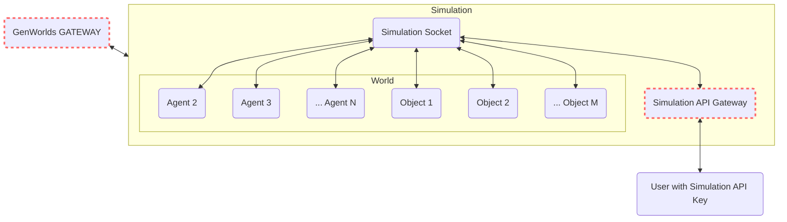

# Marketplace - Coming Soon

The Genworlds Marketplace will enable anyone to list and sell Worlds and Agents.

## For Agent developers

Monetize your hard-earned prompt-engineering skills and let your agents work for others while you sleep - all the while the Genworlds platform will handle hosting for your.

## For Users

Build your team with the best agents in the world. Rent entire Worlds set up for specific tasks, or create your own with GenWorlds Hosted Agents.

